# Onchain Ads

Author: Tim Daubenschuetz

Digital assets thrive on speculation. While our previous experiments at Kiwi
News with Harberger taxes and partial common ownership showed promise, they
missed a crucial element: enabling price discovery through "scalpers." Without
premiums exchanging hands between buyers and sellers, the market lacked the
speculative layer that drives early adoption.

Oh et al. [1] demonstrate that scalpers play an essential role in bootstrapping
demand for digital assets. They act as market makers, providing liquidity and
price discovery. This insight led us to redesign our onchain ad mechanism to
explicitly encourage early speculation.

## Why Demand-based Recurring Fees?

Pricing an ad with Harberger taxes has the benefit of the tax burden increasing
with the ad's rising demand. This improves allocative efficency for an asset
compared to the efficiency of a privately owned asset.

Unlimited private property titles, where the owner doesn't have to pay
demand-based recurring fees, lead to inefficient allocation and gives the
owners monopoly power. 

The most famous Georgist example of such a dynamic is exemplified by the above
picture of a bill board reading "EVERYBODY WORKS BUT THE VACANT LOT," in which
the private owner stated to sell the lot only by the time it had doubled in
value, hence demonstrating the allocative inefficiency of private inner city
real estate.

As Georgists argue, an ideal inner city land policy then makes land so
expensive to own over time, the cost incentivizes the owner to perfectly
utilize the land, which is why Georgists are known for promoting a continuous
land-value tax where its value is assessed regularly, but the assessment only
considers the "unimproved land value."

As crypto currency enthusiasts we understand the value of "network goods,"
goods which rise in value proportional to how well they propagate in the
network. The above graph exemplifies how this can be true for real estate too
where a dirty power plant is a much worse neighbor to have than a modern cafe
or a gym and a theatre.

### Discussion on property right limitations

True private ownership is unlimited over time, meaning that noone but the
current owner has full and unlimited control over who else may own that
property in the future. This causes inefficient allocation for unique and
non-fungible goods and, in turn, leads to bad prices.

Demand-based recurring fees limit ownership by imposing a variable fee on
holding a good. This fee is set such that, unless the owner makes good use of
the property, it's not profitable for the owner to underutilize the good.

Land value tax, but also Harberger taxes are types of demand-based recurring
fees.

## Harberger taxes

Compared to LVT, Harberger taxes decentralize the aspect of evaluating a
property by requiring the owner to self-assess its value. Whereas the valuation
process in LVT is maliciously capturable through corrupting the centralized
assessors, in the Harberger tax scheme, every owner self-assesses their
property, will however, also have sell it at that self-assessed price
immediately. 

The table below compared LVT and Harberger taxes:

| Aspect | Land Value Tax | Harberger Tax |
|---------|----------------|---------------|
| Valuation | Assessed by gov/market | Self-assessed |
| Sale | Owner keeps property | Must sell at declared value |
| Stability | Owner controls sales timing | Property can be bought any time |
| Gaming | Corruption | Some strategic pricing |

Selling at the self-assessed price immediately can can have bespoke pros and
cons depending on what type of asset that policy is applied to. But especially
the aspect that a sale can happen instantly and without the confirmation of the
current owner can create fundamental problems in many asset types, for example
[2]:

1. An ENS name that's instantly transferred to a highest bidder can make the
   old owner lose a lot of money.
2. A restaurant which had to change its location "overnight" may lose many
   long-terms customers if their new location is far away.

But there are also types of assets where a high turn over rate is actually a
good thing. There is, for example, no harm done with replacing an online ad of
a social media website several times an hour. In fact, users might even find it
enriching. Which is why we see ads, implemented as onchain, depreciating
licenses as a well-fitting model for pioneering a first fully-working Harberger
tax scheme on Ethereum.

### Onchain Ads as Depreciating Licenses

In many ways, website real estate is similar to that of inner cities. There's
only a limited amount of space and visitors' attention is scarce.

We're implementing a Harberger tax mechanims that  follows a linear price decay
function:

$$
p(t) = c \cdot (1 - \frac{t - t_0}{T})
$$

where:
- $p(t)$ is the price at time $t$
- $c$ is the collateral in ETH
- $t_0$ is the time of the last purchase
- $T$ is the period over which the collateral is fully taxed, e.g., 30 days in
  seconds (2,592,000)

The figure below shows the linear price depreciation, essentially a continuous
dutch auction.

As the tax period $T$ remains constant, and since the $(1 - \frac{t - t_0}{T})$
part will trend to zero throughout the tax period, the price depreciation of
the property in absolute terms is determined by the size of the collateral $c$.
This can be seen on the above figure on the lower graph where the initial price,
or for that matter, the size of the collateral determines the steepness of the
depreciation function.

We call this concept Depreciating Licenses.

### Basic Implementation

A basic implementation of depreciating licenses, using the $p(t)$ formula, has
users deposit Ether as collateral into a smart contract we call "Ad."

Throughout a user's holding period the collateral depreciates in value until
the owner is overbid.

Overbidding occurrs as a single transaction sending the last owner's collateral
back, sending the fees to a treasury and accepting the new owner's collateral.

The figure below visualizes that process:

That system is maximally basic. The grey background signifies that sending of
Ether during the overbidding happens throughout a single transaction.

One challenge with designing the system like this is that it's not passing
along the higher sales price to Alice. What economists call a buyer's premium
(0.5 ETH) isn't passed along. Instead, Alice gets sent back her 0.5 ETH of
leftover collateral although the ad is now worth 1 ETH. In the above
implementation, this weakens the motivation to disover and hold onto a
Harberger-tax priced property.

In practice, a problem arises with this implementation when it has to compete
with other digital property titles, which are usually priced through the
regular private ownership mechanism. Private property price discovery works
well as utility value and speculative value successfully generate a flywheel.
And while, indeed, the utility value of the onchain ad is also a motivation for
scalpers to find underpriced ad opportunities, in practice, we've observed that
it alone is too weak for generating a flywheel, especially when private
ownership is a viable model for substitution.

### Implementation Challenges in Solidity

Traditional economists often implicitly assume the actors of their systems to
be represented as individual humans. But today almost perfect financial
anonymity is possible creating a need to design financial primitives with
anonymity in mind.

```mermaid
sequenceDiagram
     participant Alice
     participant Ad
     participant Bob_A1 as Bob 👨
     participant Bob_A2 as Bob 🥷
     
     Alice->>Ad: Buys ad worth 1 ETH
     Note over Alice,Bob_A2: Alice owns ad for 6 months. <br />It depreciates to 0.5 ETH

     Bob_A1->>Ad: Buys for 0.5 ETH + 0.000001
     Ad->>Alice: Gets only 0.000001 ETH markup
     Note right of Ad: Price artificially suppressed

     Bob_A2->>Ad: 🎭 Secretly buys the ad for 1 ETH with anon account
     Ad->>Bob_A1: Gets 0.5 ETH markup
```

A simple implementation of depreciating licenses has a problem where the
premium isn't sent to the seller. The example below describes such a 
scenario:

After 15 days half of Alice's 0.5 ETH of collateral is left. But Bob
pays a  premium of 0.75 ETH. However, Alice doesn't receive these 0.75 ETH
of difference on top of also receiving back her unused 0.25 ETH.

## References 

1. Oh, Sebeom and Rosen, Samuel and Zhang, Anthony Lee, Digital Veblen Goods
   (December 5, 2023). Available at SSRN: https://ssrn.com/abstract=4042901 or
   http://dx.doi.org/10.2139/ssrn.4042901
2. Buterin, Vitalik. "The Endgame of Ethereum Name Service (ENS) Squatting."
   vitalik.eth.limo, September 9, 2022,
   https://vitalik.eth.limo/general/2022/09/09/ens.html (accessed October 28,
   2024).

## Resources

1. Price to Demand chart: https://excalidraw.com/#json=YwxqR0Cp1i0a9_Foo-u7H,bPuMWrGwnU7TP10XqG5nZA
2. p(t) on Desmos: https://www.desmos.com/calculator/dpev9ha8vf

