```mermaid
sequenceDiagram
     participant Alice
     participant Ad
     participant Bob_A1 as Bob 👨
     participant Bob_A2 as Bob 🥷
     
     Alice->>Ad: Buys ad worth 1 ETH
     Note over Alice,Bob_A2: Alice owns ad for 6 months. <br />It depreciates to 0.5 ETH

     Bob_A1->>Ad: Buys for 0.5 ETH + 0.000001
     Ad->>Alice: Gets only 0.000001 ETH markup
     Note right of Ad: Price artificially suppressed

     Bob_A2->>Ad: 🎭 Secretly buys the ad for 1 ETH with anon account
     Ad->>Bob_A1: Gets 0.5 ETH markup
```

# Onchain Ads

[This was written prior to Dec 13 and is now outdated]

Author: Tim Daubenschuetz

Digital assets thrive on speculation. While our previous experiments at Kiwi
News with Harberger taxes and partial common ownership showed promise, they
missed a crucial element: enabling price discovery through "scalpers." Without
premiums exchanging hands between buyers and sellers, the market lacked the
speculative layer that drives early adoption.

Oh et al. [1] demonstrate that scalpers play an essential role in bootstrapping
demand for digital assets. They act as market makers, providing liquidity and
price discovery. This insight led us to redesign our onchain ad mechanism to
explicitly encourage early speculation.

## Why Demand-based Recurring Fees?

Pricing an ad with Harberger taxes has the benefit of the tax burden increasing
with the ad's rising demand. This improves allocative efficiency for an asset
compared to privately owned assets.

Unlimited private property titles, where the owner doesn't have to pay
demand-based recurring fees, lead to inefficient allocations and give the
owners monopoly power. 

The most famous Georgist example of such a dynamic is exemplified by the above
picture of a billboard reading "EVERYBODY WORKS BUT THE VACANT LOT," in which
the private owner states to sell the lot only by the time it has doubled in
value, hence demonstrating the allocative inefficiency of private inner city
real estate.

As Georgists argue, an ideal inner city land policy then makes land so
expensive to own over time, the cost incentivizes owners to perfectly
utilize the land, which is why Georgists are known for promoting a continuous
land-value tax where its value is assessed regularly, but the assessment only
considers the "unimproved land value."

As crypto currency enthusiasts we understand the value of "network goods,"
goods which rise in value proportional to how well they propagate in the
network. The above image exemplifies how this can be true for real estate too.
As a land owner, having a dirty power plant as a neighbor is much worse than
having nice cafes and gyms nearby. The absurdity of inner city real estate is
that while the land appreciates from the networked improvements of the
surrounding parcels, the owner itself only has limited capability of increasing
the value of their own parcel. In that way, an inner city property owner isn't
directly in control over their land's value, the network is.

This effect is what LTV is trying to dampen. With land being the source of all
goods in the economy, and since it can create immense amounts of wealth without
necessarily needing ongoing investment, taxing land's value would ensure that
owners productively use the land or sell it to someone who can utilize it
best.

But while true private ownership is unlimited over time, meaning that no one
but the current owner has full and unlimited control over who else may own
their property in the future. This causes inefficient allocation of unique and
non-fungible goods and, in turn, leads to bad prices.

Demand-based recurring fees limit ownership by imposing a variable fee on
holding a good. This fee is set such that, unless the owner makes good use of
the property, it's not profitable for the owner to underutilize the good.

Land value tax, but also Harberger taxes, are types of demand-based recurring
fees.

## Harberger taxes

Compared to LVT, Harberger taxes decentralize the aspect of evaluating a
property by requiring the owner to self-assess its value. Whereas the land
valuation process in LVT is maliciously capturable through corrupting the
centralized assessors, in the Harberger tax scheme, every owner self-assessing
their property will also have to sell it at that self-assessed price
immediately. In that way, prices in the Harberger tax model are self-correcting.

1. Self-assess the value of your land too low, and therefore pay less taxes,
   and someone might buy it from you.
2. Self-assess the value of your land too high, and hence make it less likely
   to be bought, and you're going to pay a lot of taxes.

Harberger taxes incentivize owners to self-assess the price of their property
truthfully as to what its utility is as they're otherwise going to either lose
access to the property or pay so much taxes that it makes holding the property
unprofitable.

The table below compares LVT and Harberger taxes:

| Aspect | Land Value Tax | Harberger Tax |
|---------|----------------|---------------|
| Valuation | Assessed by gov/market | Self-assessed |
| Sale | Owner keeps property | Must sell at declared value |
| Stability | Owner controls sales timing | Property can be bought any time |
| Gaming | Corruption | Some strategic pricing |

Taking a closer look at the above table, we can see that considering all
aspects, Harberger taxes have the same benefit as LVT, but they also prevent
the centralized value assessor from being capturable.

As for the stability of a Harberger tax priced property, since it may have to
be sold instantly, it can have bespoke pros and cons depending on which asset
types the policy is applied to. Especially the aspect that a sale can happen
instantly and without the confirmation of the current owner creates fundamental
problems in many asset markets, for example [2]:

1. An ENS name that's instantly transferred to a highest bidder can make the
   old owner lose a lot of money.
2. A restaurant which has to change its location "overnight" may lose many
   long-terms customers if their new location is too far away.

But there are types of assets where a high turn over rate is actually a
positive externality. There is, for example, no harm done with replacing an
online ad on a social media website several times an hour. In fact, users might
even find that it enriches their experience. Which is why we see onchain ads,
implemented as depreciating licenses, as a well-fitting model for pioneering a
Harberger tax scheme on Ethereum.

### Onchain Ads as Depreciating Licenses

In many ways, website real estate is similar to that of inner cities. There's
only a limited amount of space and visitors' attention is scarce. The website's
curators are responsible for increasing the ad space's value, not the ad
publisher etc..

We're implementing a Harberger tax mechanism that follows a linear price decay
function:

$$
p(t) = c \cdot (1 - \frac{t - t_0}{T})
$$

where:
- $p(t)$ is the price at time $t$
- $c$ is the collateral in ETH
- $t_0$ is the time of the last purchase
- $T$ is the period over which the collateral is fully taxed, e.g., 30 days in
  seconds (2,592,000)

The figure below shows the linear price depreciation, essentially a continuous
dutch auction.

In the example above, the tax period is always 30 days, which means that the
entire collateral is taxed over that period. Notice what this does to the
steepness of price decay. The higher the initial price $p(0)$, the more
collateral (in absolute terms) will depreciate during the tax period. The lower
chart shows this more clearly by comparing the holding costs of the same ad, at
two different price points for a roughly similar-length period.

In more mathematical terms: As the tax period $T$ remains constant, and since
the $(1 - \frac{t - t_0}{T})$ part will trend to zero throughout the tax
period, the price depreciation of the property in absolute terms is determined
by the size of the collateral $c$. This can also be seen in the above figure on
the lower graph where the initial price, or for that matter, the size of the
collateral determines the steepness of the depreciation function.

We call this concept Depreciating Licenses.

## Implementing Depreciating Licenses in Solidity

Now, when actually implementing the theory of LVT, Harberger taxes and
depreciating licenses into Solidity there are all sorts of challenges which
arise from the pseudonomous nature of online identity. We'll shed some light on
the challenges and how we've overcome them in our implementation.

First of all, a basic implementation of depreciating licenses, using the $p(t)$
formula, has users deposit Ether as collateral into a smart contract we call
"Ad." Throughout a user's holding period the collateral then depreciates in
value until the owner is overbid. Overbidding occurs as a single transaction
sending the last owner's collateral back, sending the fees to a treasury and
accepting the new owner's collateral.

The figure below visualizes that process:

What we can see here is that Alice initially buys the Ad for 1 ETH and that her
collateral depreciates over 15 days by 50% (at this point, the ad is worth 0.5
ETH). Bob then buys the ad for 1 ETH, and, in the process of overbidding Alice
sending her leftover collateral back and the tax revenue (0.5 ETH) to the
treasury. 

Note how Bob's interactions are highlighted with a background in grey. That is
to show that Bob buying the ad for 1 ETH, and sending Alice's remaining
collateral back, and sending the taxes to the treasury is just done in one
transaction, all triggered by Bob overbidding Alice.

One challenge, however, with designing the system like this is that it's not
passing along the higher sales price of Bob (1 ETH) to Alice. What economists
call a buyer's premium (0.5 ETH) isn't passed along. Instead, Alice gets sent
back her 0.5 ETH of leftover collateral although the ad is now worth 1 ETH. In
the above implementation, this weakens participants' motivation to disover and
hold onto a Harberger-tax priced property. That problem specifically arises as
most digital property is priced through private ownership, giving scalpers both
the possibility of using a bought asset's utility and speculative value.

Private property price discovery works well as utility value and speculative
value successfully generate a flywheel to incentivize trading. And while,
indeed, the utility value of the onchain ad may also be a motivation for
ad-publishing scalpers to trade the ad, in practice, we've observed that its
utility value alone is too weak for generating a price discovery flywheel,
especially when, to exploit price differentials, private ownership is a widely
understood substitution model.

### Adding a buyer's premium

Surprisingly, adding a buyer's premium into the above model isn't straight
forward. Onchain Harberger tax properties require a buffer of Ether that's
being depreciated. Adding extra logic to deprecate collateral at, for example
twice the speed may add unnecessary complexity.

So if a premium is paid for acquiring the ad, the new collateral in the ad
contract must reflect the level of premium paid during the owner replacement.
Yet, during the overbidding, the excess Ether must also be sent to the seller.
Which shows that, surprisingly, a premium has to be paid twice. Once as a
to-be-depreciated buffer, remaining in the ad contract, and once as a one-off
payment to the seller. This is arguably a bit more involved than, for example,
selling a used car on a secondary market, where the buyer simply passes a
premium to the seller.

In the above figure, Bob still buys the ad for 1 Ether, however, now the
premium is:

$$
premium = \frac{c_{new} - p(t)}{2}
$$

where:
- $c_{new}$ is the new collateral amount
- $p(t)$ is the last price before Bob's bid.

Meaning that Bob is actually re-pricing the ad to 0.75 Ether while forwarding
0.25 Ether as a one-off payment to Alice.

Beyond the curiosity of having the split the excess Ether in half there's also
an issue with how a contract best passes on this premium from seller to buyer.
As perfect financial anonymity is possible today, we have no choice but to
design primitives with it in mind. The figure below shows one example we've
encountered where Bob manages to artificially suppress the premium paid to
Alice by creating two accounts, where Bob's first account buys the ad for a
small premium, and then ramps up the price through his second account,
effectively sending the premium from his second, to his first account.

## References 

1. Oh, Sebeom and Rosen, Samuel and Zhang, Anthony Lee, Digital Veblen Goods
   (December 5, 2023). Available at SSRN: https://ssrn.com/abstract=4042901 or
   http://dx.doi.org/10.2139/ssrn.4042901
2. Buterin, Vitalik. "The Endgame of Ethereum Name Service (ENS) Squatting."
   vitalik.eth.limo, September 9, 2022,
   https://vitalik.eth.limo/general/2022/09/09/ens.html (accessed October 28,
   2024).

## Resources

1. Price to Demand chart: https://excalidraw.com/#json=YwxqR0Cp1i0a9_Foo-u7H,bPuMWrGwnU7TP10XqG5nZA
2. p(t) on Desmos: https://www.desmos.com/calculator/dpev9ha8vf
