# Onchain Ads

Digital assets thrive on speculation. While our previous experiments with
Harberger taxes and partial common ownership showed promise, they missed a
crucial element: enabling price discovery through "scalpers." Without premiums
exchanging hands between buyers and sellers, the market lacked the speculative
layer that drives early adoption.

Oh et al. [1] demonstrate that scalpers play an essential role in bootstrapping
demand for digital assets. They act as market makers, providing liquidity and
price discovery. This insight led us to redesign our onchain ad mechanism to
explicitly encourage early speculation.

## Harberger tax pricing

Pricing an ad with Harberger taxes has the benefit of the tax burden increasing
with the ad's rising demand. Unlimited private property rights where the owner
doesn't have to pay demand-based recurring fees leads to inefficient allocation
and gives the owner monopoly power. 

### Discussion on property right limitations

True private ownership is unlimited over time, meaning that noone but the
current owner has full and unlimited control over who else may own that
property in the future. This causes inefficient allocation for unique and
non-fungible goods and, in turn, leads to bad prices.

Demand-based recurring fees limit ownership by imposing a variable fee on
holding a good. This fee is set such that, unless the owner makes good use of
the property, it's not profitable for the owner to underutilize the good.

Harberger taxes propose such recurring fees on the price of a good.

### Depreciating licenses

The Harberger tax mechanism follows a linear decay function:

$$
p(t) = c \cdot (1 - \frac{t - t_0}{T})
$$

where:
- $p(t)$ is the price at time $t$
- $c$ is the collateral in ETH
- $t_0$ is the time of the last purchase
- $T$ is the period over which the collateral is fully taxed, e.g., 30 days in
  seconds (2,592,000)

The figure below shows the linear price depreciation, dutch auction style.

As the tax period $T$ remains constant, and since the $(1 - \frac{t - t_0}{T})$
part will trend to zero throughout the tax period, the price depreciation of
the property in absolute terms is determined by the size of the collateral $c$.
This can be seen on the above figure on the lower graph where the initial price,
or for that matter, the size of the collateral determines the steepness of the
depreciation function.

We call this concept Depreciating Licenses.

### Basic Implementation

A basic implementation of depreciating licenses, using the $p(t)$ formula, has
users deposit Ether as collateral into a smart contract we call "Ad."

Throughout a user's holding period the collateral depreciates in value until
the owner is overbid.

Overbidding occurrs as a single transaction sending the last owner's collateral
back, sending the fees to a treasury and accepting the new owner's collateral.

The figure below visualizes that process:

That system is maximally basic. The grey background signifies that sending of
Ether during the overbidding happens throughout a single transaction.

One challenge with designing the system like this is that it's not passing
along the higher sales price to Alice. What economists call a buyer's premium
(0.5 ETH) isn't passed along. Instead, Alice gets sent back her 0.5 ETH of
leftover collateral although the ad is now worth 1 ETH. In the above
implementation, this weakens the motivation to disover and hold onto a
Harberger-tax priced property.

In practice, a problem arises with this implementation when it has to compete
with other digital property titles, which are usually priced through the
regular private ownership mechanism. Private property price discovery works
well as utility value and speculative value successfully generate a flywheel.
And while, indeed, the utility value of the onchain ad is also a motivation for
scalpers to find underpriced ad opportunities, in practice, we've observed that
it alone is too weak for generating a flywheel, especially when private
ownership is a viable model for substitution.

### Implementation Challenges in Solidity

Traditional economists often implicitly assume the actors of their systems to
be represented as individual humans. But today almost perfect financial
anonymity is possible creating a need to design financial primitives with
anonymity in mind.

```mermaid
sequenceDiagram
     participant Alice
     participant Ad
     participant Bob_A1 as Bob 👨
     participant Bob_A2 as Bob 🥷
     
     Alice->>Ad: Buys ad worth 1 ETH
     Note over Alice,Bob_A2: Alice owns ad for 6 months. <br />It depreciates to 0.5 ETH

     Bob_A1->>Ad: Buys for 0.5 ETH + 0.000001
     Ad->>Alice: Gets only 0.000001 ETH markup
     Note right of Ad: Price artificially suppressed

     Bob_A2->>Ad: 🎭 Secretly buys the ad for 1 ETH with anon account
     Ad->>Bob_A1: Gets 0.5 ETH markup
```

A simple implementation of depreciating licenses has a problem where the
premium isn't sent to the seller. The example below describes such a 
scenario:

After 15 days half of Alice's 0.5 ETH of collateral is left. But Bob
pays a  premium of 0.75 ETH. However, Alice doesn't receive these 0.75 ETH
of difference on top of also receiving back her unused 0.25 ETH.

## References 

1. Oh, Sebeom and Rosen, Samuel and Zhang, Anthony Lee, Digital Veblen Goods
   (December 5, 2023). Available at SSRN: https://ssrn.com/abstract=4042901 or
   http://dx.doi.org/10.2139/ssrn.4042901

## Resources

1. Price to Demand chart: https://excalidraw.com/#json=YwxqR0Cp1i0a9_Foo-u7H,bPuMWrGwnU7TP10XqG5nZA
2. p(t) on Desmos: https://www.desmos.com/calculator/dpev9ha8vf

